# Splitting a Flux 2 LoRA: Composition vs Style, and What Actually Separates

*By Orph the Loreweaver. Funded by a Banodoco micro-grant that asked for honest results, positive and negative. This is both.*

## The bet

Take one image dataset. Train it twice with identical settings except a single flag, `content_or_style`, which biases the diffusion timesteps the LoRA learns from. Content mode trains on high-noise steps, where a generation's composition is decided. Style mode trains on low-noise steps, where surface and texture resolve. The bet was that this gives you two LoRAs that act as separate dials, one for composition and one for surface, and that you can recombine them at inference to compose a scene and then choose its look independently.

I should be upfront: the split itself isn't my idea. That high-noise steps set composition and low-noise steps set surface is documented behavior, not a discovery; ai-toolkit's `content_or_style` flag ships described in almost these words, and people have separated models into recombinable style and content LoRAs before, by picking specific network blocks rather than by biasing timesteps. So treat this as a personal bet, not a claim of novelty, and assume the premise is old news to plenty of readers. What I wanted was narrower and more practical: when you push the timestep split hard on Flux 2 and actually try to recombine the halves, what really comes apart, what doesn't, and where does it break? The interesting answer turned out not to be the split but which half carries the thing I was chasing.

I trained the pair on Flux 2 dev, network rank 128/64/64/32, 15k steps each, checkpoints every 500. Then I let the question sit for a week because the evaluation got out of hand, and I came back to it with a smaller test. This is what that test found.

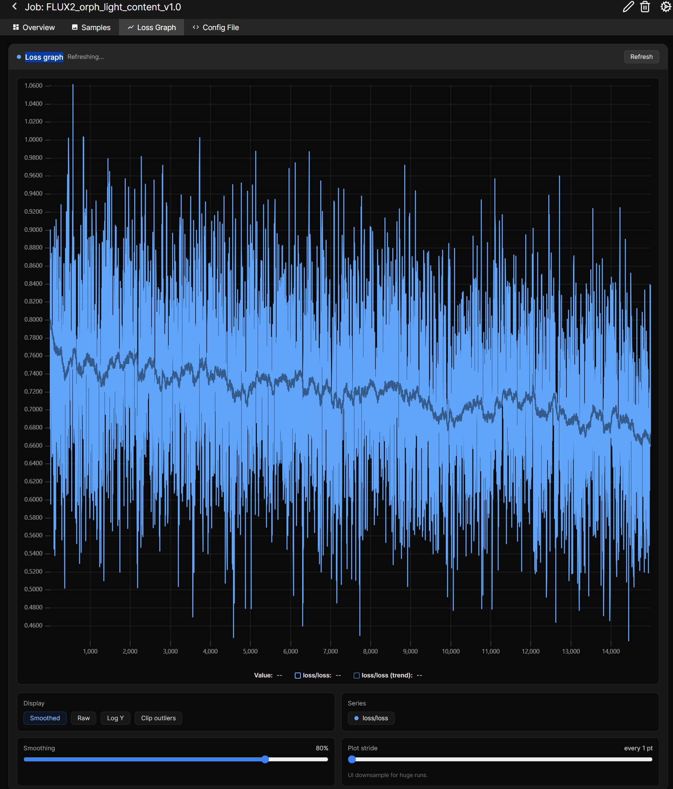
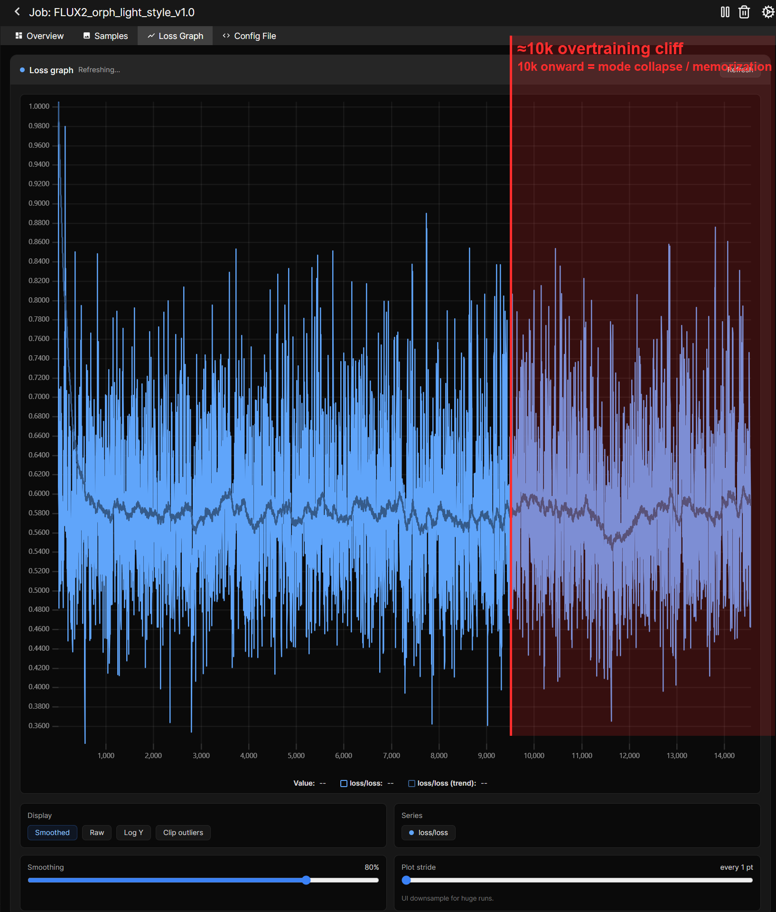

*Training loss for the two runs, content (top) and style (bottom), both 15k steps on the identical dataset, raw in blue with the smoothed trend in grey. They show what a loss can't do: dominated by which timestep gets sampled each step, the curves stay noisy and give almost no signal about which checkpoint looks best. The red band on the style graph isn't from the loss; it marks where the visual evaluation later found the LoRA had collapsed into memorization (from ~10k; see below), a failure the loss leaves no trace of. Content carries no such band: read at the high-noise diagnostic window, even its 14k checkpoint still scored as a good checkpoint. That gap, flat loss but real and asymmetric failure, is why the evaluation here is visual rather than metric.*

## The dataset, in one paragraph

250 grayscale images chosen for compositional strength: a clear value path (value being how light and dark fall across a picture, painting its objects and spaces into a composition), light and depth doing the work, legible at thumbnail size. I kept the set deliberately heterogeneous in surface, mixing photographs, paintings, ink, and shape studies, so that the only thing the images share is how they organize light and space. Captions describe subject and medium and nothing else. No "foreground," no "shaft of light," no "high contrast," no "black and white." The trigger word `orph_light` absorbs the unspoken signal, which is the whole point. Full dataset-prep method is in the [Listening to the Stack](https://github.com/Loreweavr/Listening-to-the-Stack-A-Methodology-for-LoRA-Dataset-Prep) repo; this piece is about what the trained LoRAs do.

## Picking the content checkpoint, by eye

Each run left fifteen checkpoints, and the loss curves couldn't tell them apart (above). So I picked by eye: every content checkpoint rendered across seven test prompts, each output scored on a five-point scale I fixed before looking: one for broken, three for "fine, but the LoRA isn't doing anything the base model wouldn't," five for a checkpoint that imposes structure the prompt never asked for, like throwing contrast onto a flat scene or side-lighting an evenly-lit subject. A measured pass ran underneath (mean luminance, contrast, cross-prompt consistency), but only as a cross-check. The eye led; the numbers confirmed.

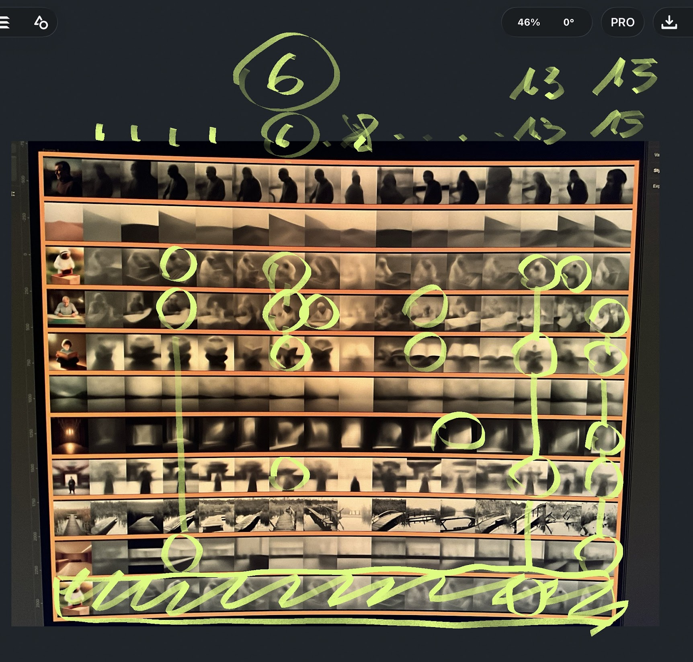

*The hand pass over the content checkpoints: rows are prompts, columns are checkpoints (1k through final). Green circles mark the picks; 6k is circled as the standout. The raw record of how the call was actually made.*

Two things fell out. First, **8k is a hole.** Every prompt at the 8k content checkpoint came back washed out and flat, the lightest checkpoint by more than 25 luminance points, with no composition signal at all. The eye caught it on one prompt early, then watched it repeat across all seven: a hunch turned finding, with the measurement agreeing. 8k was cut. (Strangely, the same step is the opposite story on the style side: style_8k is the locked midpoint, the eventual deliverable, as we'll see. Same number, inverse outcome.)

Second, and this is the part that matters later: **the good content checkpoints run all the way to the end.** 6k was the eye's pick, but 14k ran it close, and it was the one checkpoint eye and numbers fully agreed on, with the cleanest and steadiest value structure. Even the final checkpoint held up. At least at the high-noise diagnostic window where I read these, the content LoRA shows no collapse at the top of its run; I didn't test the late content checkpoints at full-step inference. The style LoRA, as we'll see, does.

## How I read it

The evaluation that stalled me was a grid: every content checkpoint against every style checkpoint at several blend weights across seven prompts. Hundreds of images, most of them mud, read at the end of a long day. That was a fatigue failure, not a result.

The version that worked started small, twelve images across three prompts, and grew to eight prompts once it was working. For each prompt at a fixed seed (`185615215668291`), I generate four:

1. base, no LoRA
2. content checkpoint only
3. style checkpoint only
4. a handoff, where the content LoRA runs the first 7 of 20 steps and the style LoRA finishes the rest

Columns 2 and 3 show what each axis contributes. Column 4 is the experiment. I committed to the reading before generating: the handoff is clean if it keeps column 2's composition while wearing column 3's surface, partial if it holds one, broken if it holds neither.

## What held: the decomposition is real, through a handoff

The handoff keeps the composition from the content LoRA and takes on most of the style LoRA's surface, eyeballed at around 80 to 90 percent; I never put a formal metric on it. The two axes do come apart and go back together.

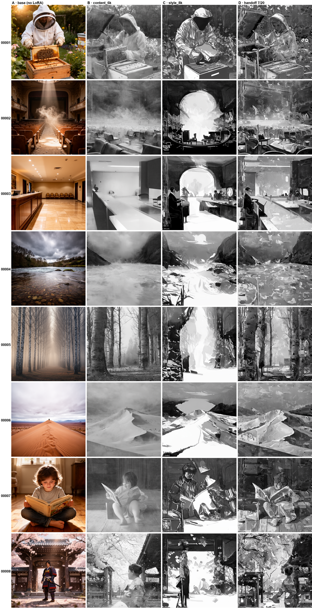

*The board: eight prompts (rows) by four conditions (columns) at one fixed seed. Columns left to right: base with no LoRA, content_6k alone, style_8k alone, the handoff. Read across a row and the handoff carries the content column's composition while taking on the style column's surface. Read the style column straight down and the dynamic black-and-white value-painting is unmistakable, the finding that reframed the project (next section). The figural rows, beekeeper and child, are where it strains, by design.*

The mechanism detail matters for anyone reproducing this. Loading both LoRAs at full strength in a single sampling pass produces a crude combination, the two fighting across every step. Running them in sequence works, content early and style late, because composition is settled in the high-noise steps and surface in the low-noise steps. That is the same reason content checkpoints were selected at an early-stop window and style checkpoints at full denoise. The handoff is just those two evaluation passes stitched into one generation.

## The surprise: the thing I wanted lives in the style axis

I built this for composition control. What I actually wanted, from before the hypothesis existed, was a LoRA that paints a scene in dynamic black and white with hard value separation. I assumed the content LoRA would deliver that, because I file "value structure" under composition.

It does not. The style checkpoint does. Or at least...it does it better than the pure content LoRAs.

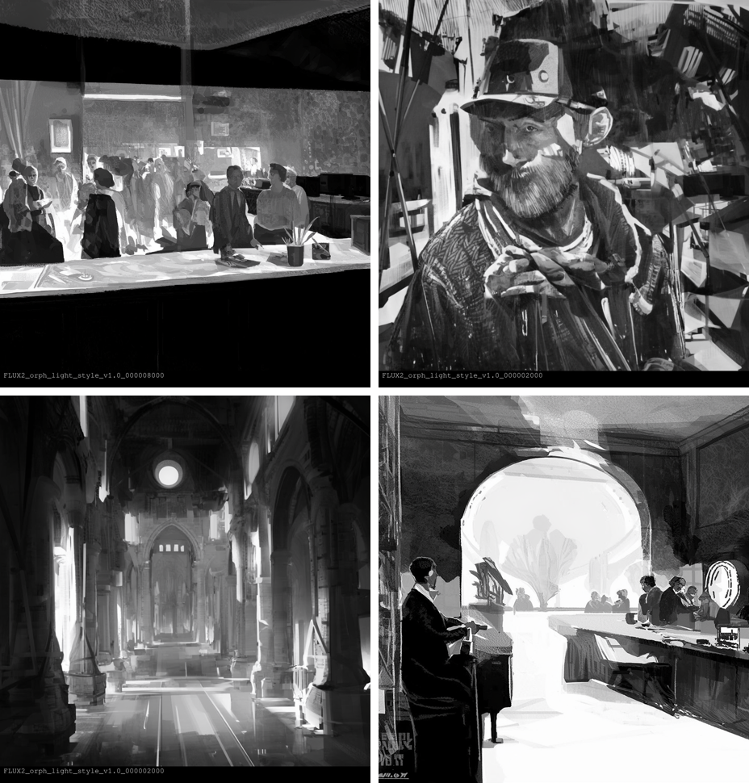

*Two style_2k and style_8k outputs, no content LoRA and no handoff: a crowded interior, a weathered portrait, a light-flooded chapel, and a hotel lobby. The crisp black-and-white value separation, the thing I built the whole project to get, is right there in the style checkpoint by itself.*

"Value" turns out to be two separate things. Where the light falls, the broad light and dark masses, is global and decided in high-noise steps, so it lives in the content LoRA. The crisp rendering of blacks and whites, the actual painted contrast, is local and resolves in low-noise steps, so it lives in the style LoRA. I wanted the second one. It is a low-noise property. My training intuition put it in the wrong box, and the test corrected me.

The practical consequence is that the deliverable is the style branch, used alone. The style checkpoint at full strength gives the value-painting I was after and lands the composition correctly most of the time without any help. The grant project's real product came out of the run I had labeled the weaker half ;)

## What did not separate cleanly: style carries form

The axes are not orthogonal. On an empty-theater prompt, the style LoRA reshaped the chairs, not just their texture. It exercises authority over object geometry, not only surface.

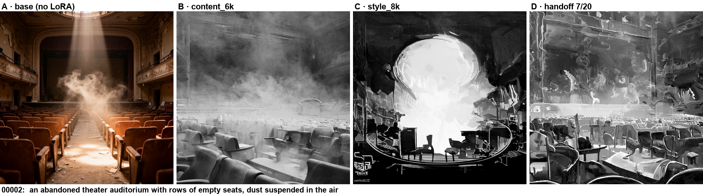

*The empty-theater prompt across all four conditions (labels in-frame: base, content_6k, style_8k, handoff). Watch the seats. In the style and handoff columns they are not merely re-textured, their shapes dissolve and reform under the style's hand. That is the style LoRA exercising authority over geometry, not surface alone.*

Two reasons. The `content_or_style` flag is a sampling bias, not a hard cut, so the style LoRA still saw whole objects during training. And in the handoff it runs 13 of 20 steps, enough budget to move mid-frequency structure, not just paint the final pixels. "Style" here means surface plus some learned form.

## The handoff step is a control, not a fixed number

Because of that entanglement, the step where you switch LoRAs should itself be a dial, though I only ran one handoff (step 7) and haven't done the sweep, so what follows is expectation, not a result. I expect that handing off late, around step 11 of 20, leaves the content LoRA owning the structure while style only finishes the surface, the cleanest separation; hand off early, around step 4, and style should co-author the forms. If that holds, the bleed of style into shape is a control surface you set, not a defect to remove.

## Where the LoRA breaks

Faces simplify. The style checkpoint softens fine detail by design, and a face is the hardest subject for any style LoRA. A child reading a book, the hardest prompt in the set, came apart in both the style-only and handoff columns.

The cause generalizes. At full strength on a subject the dataset never contained, the LoRA suppresses the base model's own knowledge of that subject and drags the image toward the dataset's distribution. Dropping strength to 0.6 or 0.8 lets the base model render the subject while the LoRA seasons it. The rarer the subject relative to your dataset, the lower the strength has to go. Strength is not one global number; it scales with how far the subject sits from your training set.

## The asymmetry was built in, on purpose

Composition factored cleanly. Style did not. That split is a direct consequence of the dataset design, and it was predictable.

The heterogeneity that makes the content LoRA work, many surfaces sharing one compositional language, is exactly what starves a style LoRA. There is no single coherent surface to learn, so the style run averages toward a muddle and, pushed hard, falls back on memorizing whole training images. A crisp single-style LoRA would need a style-coherent subset, which is a different dataset and a different run. So the decomposition is asymmetric by construction: the composition half is the success, the style half is a usable partial. That is the honest version of the result, and it is the more interesting one.

## Two byproducts worth keeping

From about 10k on, the style LoRA collapsed. Every prompt produced the same memorized image regardless of input, a clean and measurable overtraining boundary for this dataset size and configuration (250 images, about 60 epochs at 15k steps). Cap well short of that, or know the useful checkpoints all sit below 10k; 9k is the last one that still answers the prompt.

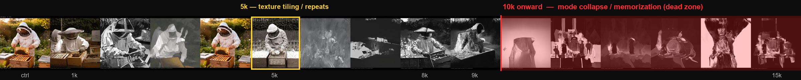
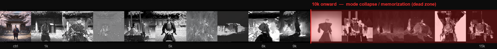

*The style LoRA across its full checkpoint ladder (control, then 1k to 15k) on two prompts at one fixed seed (beekeeper, top; samurai, bottom). The red band is the dead zone: from 10k on, every checkpoint decays into the same memorized, prompt-agnostic image, the collapse made visible (9k, just left of the band, is the last that still answers the prompt). Note also the odd behaviour at 5k (boxed, top): on a figural subject the style turns into seamless texture tiling, like a crude gradient on a formless subject but visibly repeating across a figure.*

Below the cliff, individual checkpoints settled into distinct aesthetics rather than degrees of the same one: expressionist ink around 2k, a ghost-wash around 3k, texture tiling around 5k, the controllable transfer point at 8k, an eerie register at 9k. The imperfect decomposition produced a catalog of deployable presets as a side effect. Each becomes its own LoRA once you tune its strength.

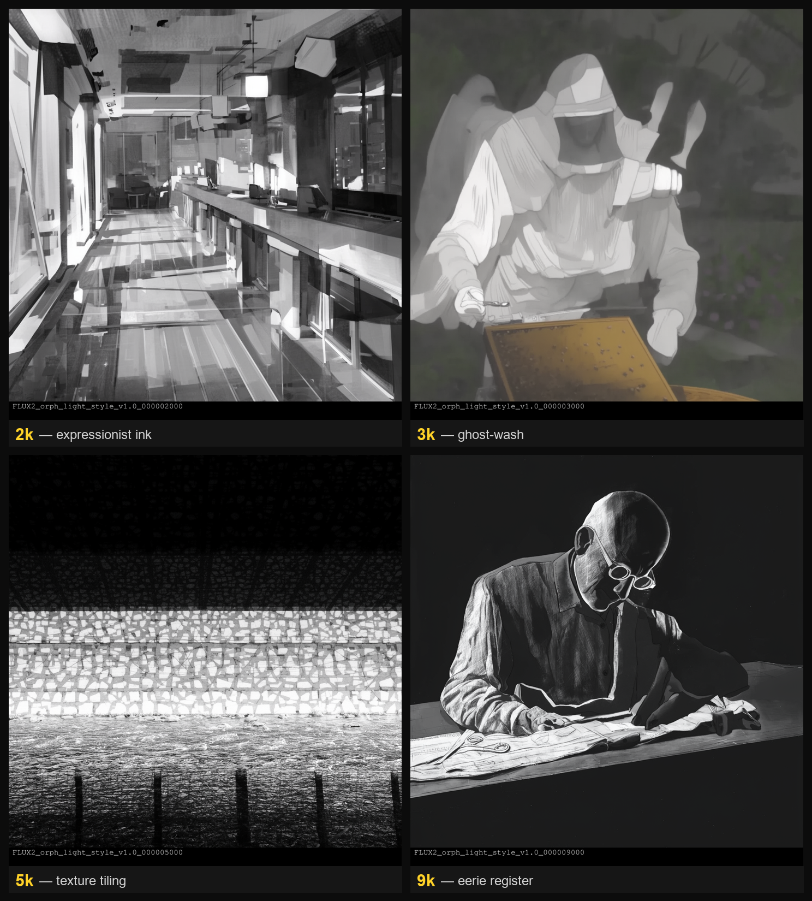

*Four checkpoints from below the cliff, style LoRA alone at one fixed seed: 2k expressionist ink, 3k ghost-wash, 5k texture tiling, 9k eerie register. None is a degraded version of the others. Each is a distinct, deployable aesthetic the imperfect decomposition threw off as a byproduct, and each becomes its own preset once you tune its strength.*

## What I would actually ship

The style checkpoint at 8k, full strength, as a single value-painting LoRA that also lands composition most of the time. The content checkpoint as a composition-forcing first stage in the handoff, for the cases where the style LoRA's composition misses and you need to dictate the layout. Use lower strength (0.6 to 0.8) on faces and on subjects far from the training set.

The style_8k LoRA is on Hugging Face: [loreweavr/orph_light_style_8k](https://huggingface.co/loreweavr/orph_light_style_8k).

## Where this points: composition as a reusable input (untested)

There are two ways to recombine composition and style, and I only tested one. The handoff does it inside the diffusion trajectory, at the level of weights. The other route does it at the level of images, and it fits the original intent better.

That intent was never to make the LoRA the final renderer. It was to author composition that feeds further generation. The image-level route makes that literal. Generate a finished value image with the style checkpoint, then use that image as the control for a second generation running any other LoRA: img2img at a moderate denoise, a structure or luminance ControlNet, or a reference latent. The first image supplies the lighting and value layout. The second render supplies the surface.

The decomposition result is what makes this attractive. Value-painting lives in the style axis, so the style checkpoint's output is already a strong lighting scaffold. You treat it as the hint for where the light and the dark masses sit, then paint over it with whatever style you actually want, including styles this LoRA never learned. The handoff couples composition and style at the weight level; the scaffold decouples them at the image level, so it can drive styles far outside the training set.

I have not run this yet. The questions it raises: which conditioning mechanism holds the value structure without freezing the surface (img2img denoise strength, a depth or luminance ControlNet, reference-only), how much of the value layout survives the over-paint, and whether it beats the handoff on flexibility. It is the experiment after the balanced control.

## The control: one balanced LoRA, or two specialized?

All of the above pits two specialized LoRAs and a handoff against each other. It left the obvious baseline untested: one LoRA trained in balanced mode, sampling the full timestep range, learning composition and surface together. If a single balanced LoRA could match the specialized style branch, the decomposition would be a fact about how diffusion timesteps carry composition versus surface, not a workflow anyone needs to run. So I trained it, capped at 12k steps, expecting it to converge *later* than either biased run since it has to reach competence on both axes at once.

It converged earlier, and worse. The balanced LoRA overcooks by about 8k, sooner than the style run's ~10k and far sooner than the content run that stayed useful to 14k. Its usable window isn't just narrow, it's unstable: down the checkpoint ladder, 5k is acceptable, 6k is broken, 7k is acceptable, 8k is gone. No stable band, just isolated checkpoints flanked by broken neighbors. And the two that survive are weak. 5k is clean but photographic, a grayscale photo rather than value-painting, because with no coherent surface to learn it simply lets the base model's rendering show through. 7k has painterly character but reads eerie and only rates "acceptable." Past 10k the LoRA stops answering the prompt entirely: the same memorized image comes back no matter what you ask for, the same collapse the style run hit, arriving sooner. A third prompt, the out-of-distribution samurai, didn't even yield a survivor: no checkpoint on that subject was usable at all.

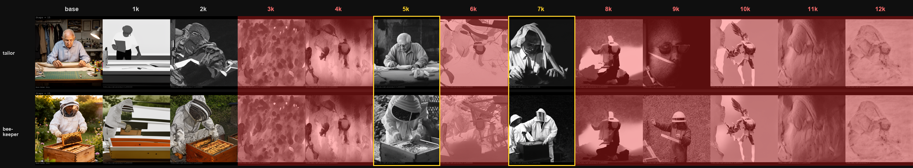

*The balanced LoRA across its checkpoint ladder (base, then 1k to 12k) on two prompts, tailor (top) and beekeeper (bottom), at one fixed seed. Red marks the broken checkpoints, yellow boxes the only two usable ones (5k and 7k). The pattern is the point: the usable checkpoints are isolated islands, each flanked by broken neighbors, so there is no stable band to select from, and everything from 8k up is gone. Past 10k both prompts collapse to the same memorized texture regardless of input, the tell that the LoRA has stopped responding to the prompt and is replaying memorized training content.*

So the answer is no. One balanced LoRA does not replace the split. Its best checkpoint never reaches the stable, crisp value-painting the style branch gives you at 8k, and it can't even offer a *reliable* checkpoint to choose from.

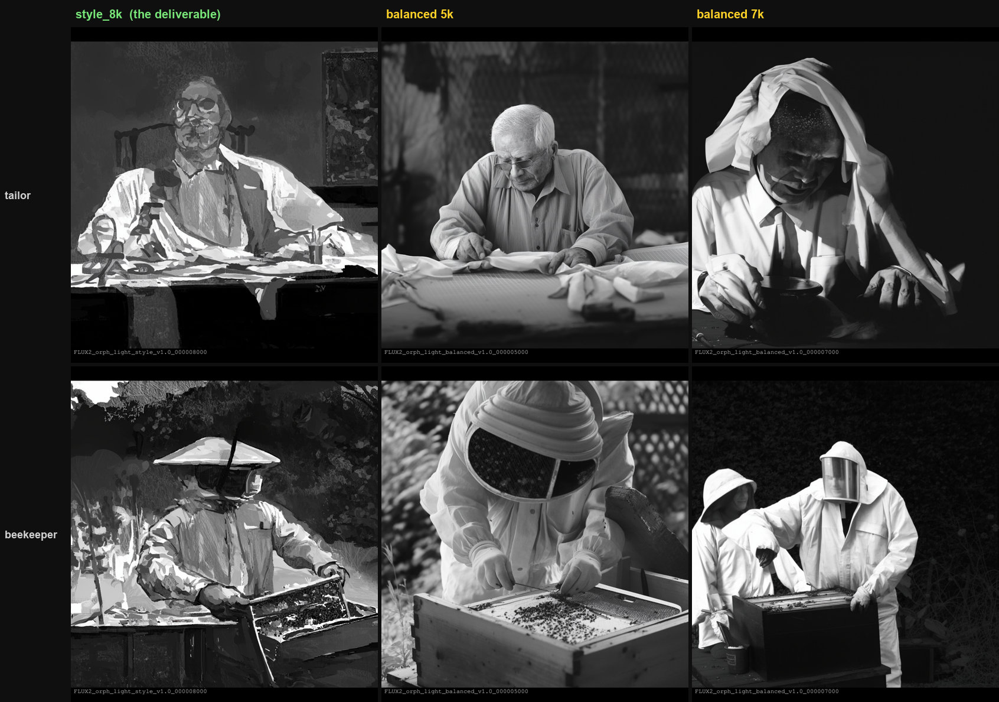

*The verdict, side by side, same prompts and seed: the style branch's deliverable (style_8k) against balanced's two best checkpoints (5k, 7k). style_8k paints in value, with crisp light-and-dark masses doing the work. balanced_5k is clean but photographic, a grayscale photo rather than a painting; balanced_7k has more painterly character but reads rough, uneven, overexposed. Neither balanced checkpoint reaches the style branch's value-painting. That is the whole answer to the control.*

The reason is the same asymmetry, sharpened to its worst case. Balanced has to learn both the signal and the noise in one set of weights. Composition is the signal the heterogeneous set teaches cleanly; surface is the noise it never agrees on. The content run feeds on that variety; the balanced run chokes on it, spending half its capacity trying to fit a surface distribution that has no pattern, which is exactly what drives the early memorization. The decomposition isn't a curiosity the balanced control made redundant. It's the thing that lets the composition signal survive at all, and the specialized style branch stays the deliverable.

## Reproduce it

- Training configs (content, style, balanced): `LoRA-Configs/orph_light/v1.0/`.
- Dataset prep and the inverted captioning rules: the [Listening to the Stack](https://github.com/Loreweavr/Listening-to-the-Stack-A-Methodology-for-LoRA-Dataset-Prep) methodology.
- Decomposition test: four conditions per prompt, fixed seed `185615215668291`, Flux 2 dev, 20 steps, dpmpp_2s_ancestral / sgm_uniform, guidance 2.5. Handoff at step 7 of 20 (content `0->7` with leftover noise, style `7->20`). The ComfyUI workflow is in `workflow/`.

The single thing I would tell anyone trying this: train your composition LoRA on a stylistically varied set and your style LoRA on a coherent one. They want opposite datasets. Trying to get both from one set gives you a strong composition LoRA, a partial style LoRA, and the lesson that value-painting was a style property the whole time.

Orph
## License

The article text, training configs, and ComfyUI workflow in this repo are released under the [MIT License](LICENSE). The figures are outputs of a FLUX.2-dev-derived LoRA, and the `style_8k` model is hosted separately; both carry Black Forest Labs' FLUX.2-dev non-commercial terms, which take precedence for those assets.
